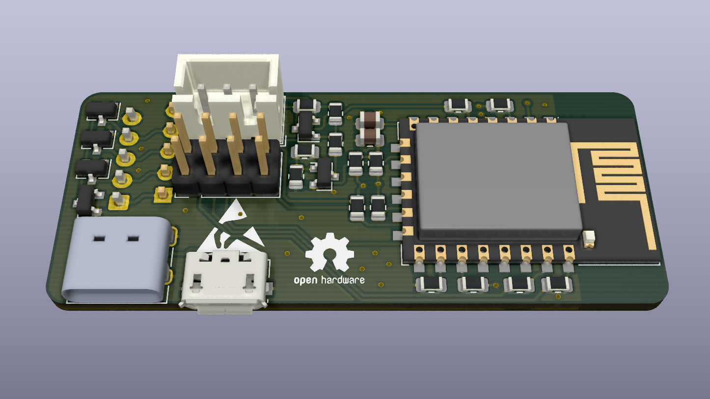
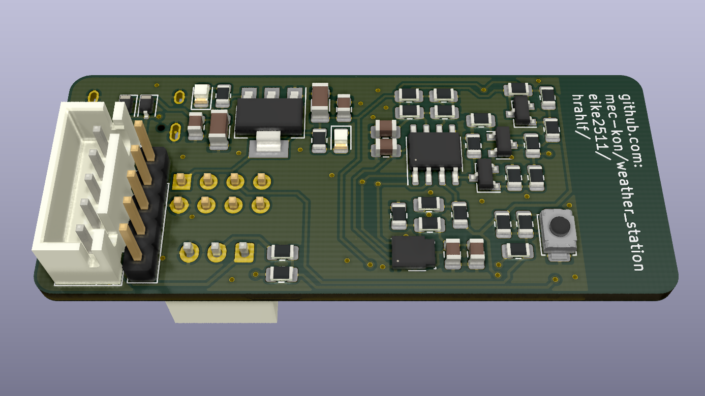
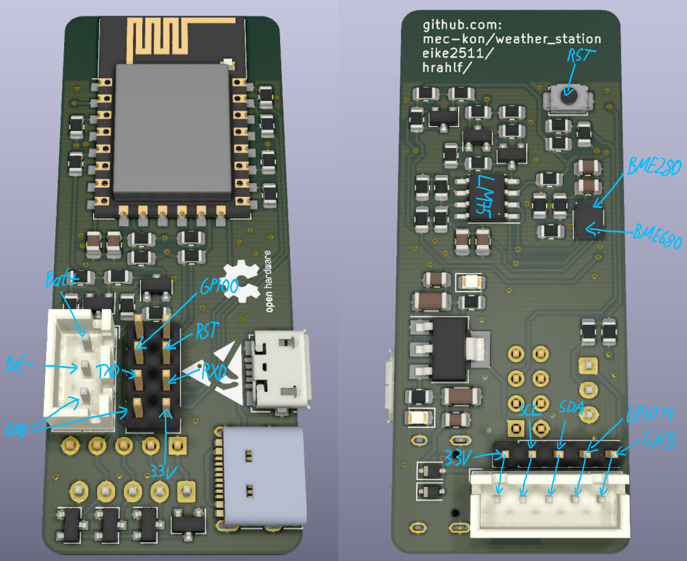

# weather station
A simple weather station hardware for recording temperature, humidity, pressure and airquality.
The measured data can be provided over WiFi by using an ESP8266.
This hardware is available as open source hardware and released under GPL-3.0 license.

## Description
This is a circuitboard based on an ESP8266 for reading and evaluating sensor data.
By using an ESP8266, it is possible to evaluate sensor data directly and make it available via MQTT, for example.
This makes it very easy to integrate the weather station into existing smart home systems such as OpenHAB, Home Assistant or ioBroker.
Furthermore, the ESP8266 has an efficient low power mode, which allows battery operation or operation on a solar cell.

## Connections

The board has six connection terminals.
Three different for the power supply, two for the connection of external sensors and one for programming the ESP8266. 
The power can be supplied via micro-usb, usb-c or via a JST-XH plug.
If the JST-XH connector is used, the capacity of a battery connected to the board can also be measured.

## Applicable sensors

For temperature measurement, either an LM75 and a BME680 or BME280 can be used.
If the air quality is to be measured as well, a BME680 needs to be used, otherwise a cheaper BME280 sensor is sufficient for temperature, air pressure and humidity.

## Low Power

To wake up the ESP8266 from low power mode, the reset pin must be connected to GPIO16. On the board presented here this connection has already been made.

## Programming

The ESP8266 can be programmed with an FTDI adapter. All needed pins can be found on the pin header on the front side.
Example Software is provided here:

##Measuring the battery level

To measure the battery level, it is recommended to use a TP4056 battery charger. An additional device for charging the battery can be connected to it.
The upper pin of the JST-XH connector then corresponds to B+, the middle to B- and the lower to GND (B- and OUT- on TP4056).

## Dimensions and Schematic

24.13mmx57.8mm