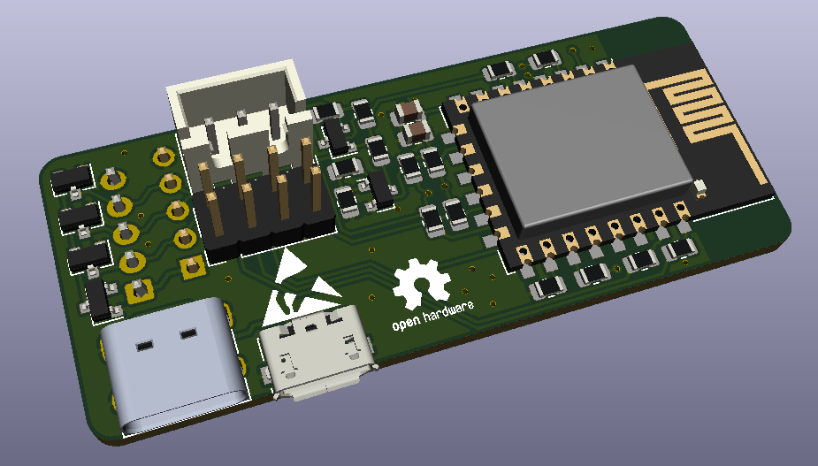

# weather station
A simple weather station hardware for recording temperature, humidity, pressure and airquality.
The measured data can be provided over WiFi by using an ESP8266.
This hardware is provided as open source hardware and released under GPL-3.0 license.

## description
This is a circuitboard based on an ESP8266 for reading and evaluating sensor data.
By using an ESP8266, it is possible to evaluate sensor data directly and make it available via MQTT, for example.
This makes it very easy to integrate the weather station into existing smart home systems such as OpenHAB, Home Assistant or ioBroker.
Furthermore, the ESP8266 has an efficient low power mode, which allows battery operation or operation on a solar cell.

## Connections

The board has six connection terminals.
Three different for the power supply, two for the connection of external sensors and one for programming the ESP8266. 

## Programming
## Low Power
## Dimensions and Schematic